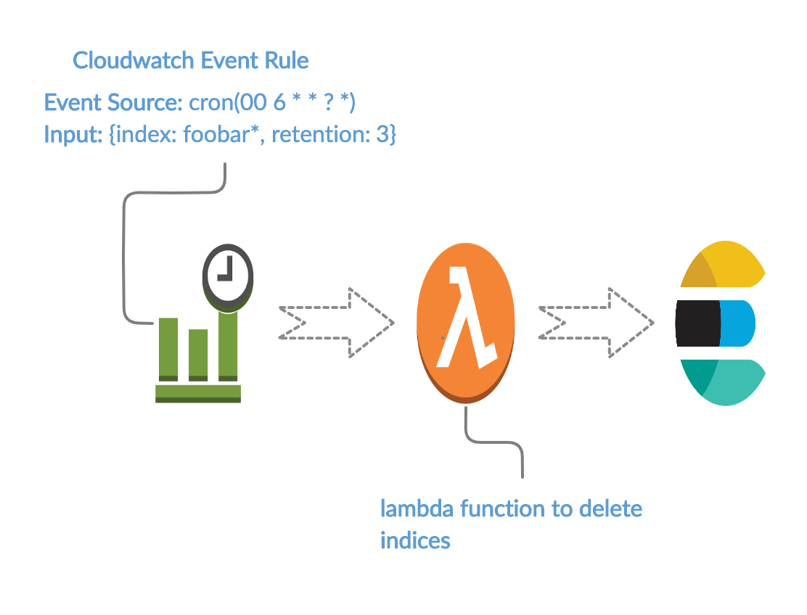

# Delete Elasticsearch Index - AWS Lambda Function

Delete the elasticsearch indices after X Days, if the indices are being created by any application or tool, ignoring the index lifecycle management polcies is the food for thought here. This AWS Lambda function allows you to delete the Elasticsearch indices after desired retention period.

  

### Simple workflow !
  - A cloudwatch event rule is scheduled to trigger after every X time span. (May be once in a day. We can use scheduled event source with some cron expression)
  - Cloudwatch event will trigger the lambda function. Input - `{"index_pattern": "foobar*", "retention": 3}`
  - Lambda will search for index pattern `foobar` which are older than 3 day and will delete it using elasticsearch api.

## Setup & Deployment

### Prerequisite
- Nodejs 10.x
- Aws Cli (AWS console also can be used to deploy)

### Deploy

- Create cloudwatch event rule.
- Create the lambda function
- Deploy the lambda fucntion
